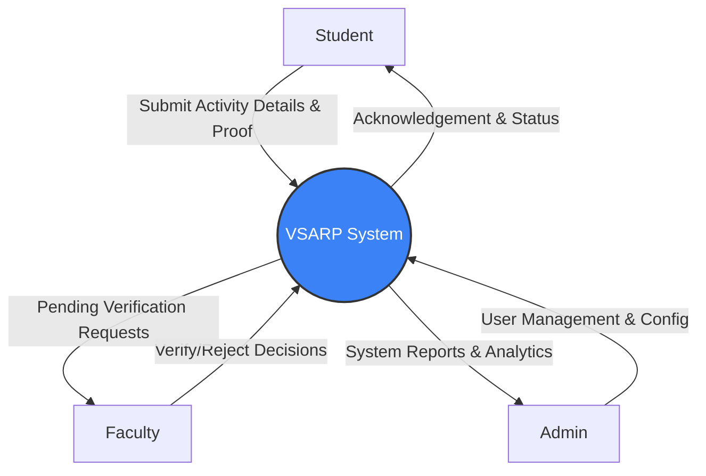
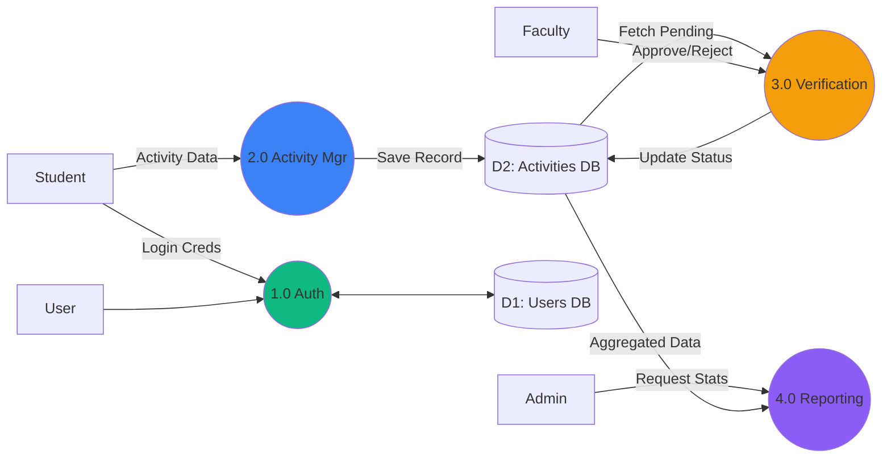
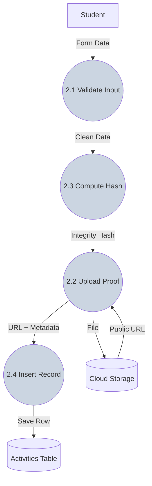
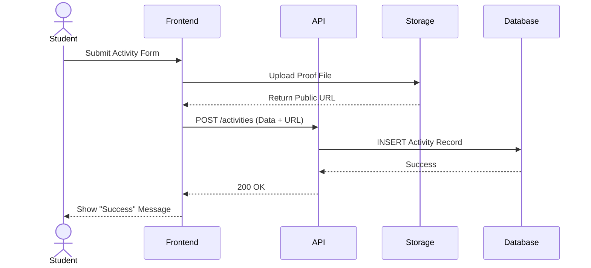
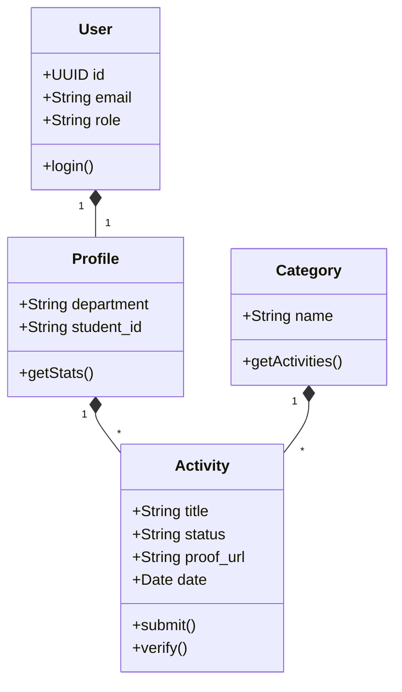

# DFD Generation Prompts
Use the following prompts to generate diagrams. I have provided **Mermaid.js code** (which you can paste into [Mermaid Live Editor](https://mermaid.live/)) and **Text Prompts** (for AI image generators).

---

## 1. DFD Level 0 (Context Diagram)
**Concept:** A single central process interacting with external entities.

### Option A: Mermaid.js Code (Recommended)
Paste this into a Mermaid editor:


### Option B: Text Prompt for AI Image Generators
> "A professional Data Flow Diagram Level 0 context diagram. Center circle labeled 'VSARP System'. Three external entities in rectangular boxes surrounding it: 'Student', 'Faculty', and 'Admin'. Arrows show data flow: Student sends 'Activity Submission', Faculty sends 'Approval', Admin sends 'Configuration'. Clean, modern line art style, blue and white color scheme, white background."

---

## 2. DFD Level 1 (High-Level Processes)
**Concept:** Breaking the system into major functional modules.

### Option A: Mermaid.js Code


### Option B: Text Prompt for AI Image Generators
> "A Data Flow Diagram Level 1 showing 4 main circular processes: 'Authentication', 'Activity Submission', 'Verification', and 'Reporting'. External entities 'Student' and 'Faculty' connect to these processes. Rectangular data stores labeled 'User DB' and 'Activity DB' connected with arrows. Technical flowchart style, flat design, distinctive colors for each process."

---

## 3. DFD Level 2 (Detailed Drill-Down of 'Activity Submission')
**Concept:** Deep dive into exactly what happens when a student submits.

### Option A: Mermaid.js Code


### Option B: Text Prompt for AI Image Generators
> "Detailed DFD Level 2 flowchart focusing on 'Activity Submission'. Four sequential circles: 'Validate Input', 'Compute Hash', 'Upload to Storage', 'Insert Record'. Arrows show linear flow from Student to Database. Includes a cylinder icon for 'Database' and a cloud icon for 'Storage'. Minimalist tech diagram style."

---

## 4. UML Diagrams (Slide 16)
**Concept:** Three distinct diagrams to show System Actors, Logic Flow, and Data Structure.

### A. Use Case Diagram
**Text Prompt for Gemini Pro:**
> "Generate Mermaid.js code for a Use Case Diagram for a 'Student Activity Verification System'. Actors: Student, Faculty, Admin. Use Cases: 'Submit Activity', 'View History' (Student); 'Approve Activity', 'Reject Activity' (Faculty); 'Manage Users', 'View Reports' (Admin). Include relationships."

**Mermaid Code:**
```mermaid
useCaseDiagram
    actor "Student" as S
    actor "Faculty" as F
    actor "Admin" as A

    package "VSARP System" {
        usecase "Submit Activity" as UC1
        usecase "View History" as UC2
        usecase "Approve/Reject" as UC3
        usecase "View Pending" as UC4
        usecase "Manage Users" as UC5
        usecase "View Analytics" as UC6
    }

    S --> UC1
    S --> UC2
    F --> UC3
    F --> UC4
    A --> UC5
    A --> UC6
```

### B. Sequence Diagram (Submission Flow)
**Text Prompt for Gemini Pro:**
> "Generate Mermaid.js code for a Sequence Diagram showing 'Activity Submission'. Participants: Student, Frontend, API, Database, Storage. Flow: Student submits form -> Frontend uploads proof to Storage -> Storage returns URL -> Frontend sends data+URL to API -> API saves to Database -> Database confirms -> Frontend shows Success."

**Mermaid Code:**


### C. Class Diagram
**Text Prompt for Gemini Pro:**
> "Generate Mermaid.js code for a Class Diagram for a Student Activity System. Classes: User (id, email, role), Profile (dept, student_id), Activity (title, status, proof_url, date), Category (name). Relationships: User 1--1 Profile, Profile 1--* Activity, Category 1--* Activity."

**Mermaid Code:**

